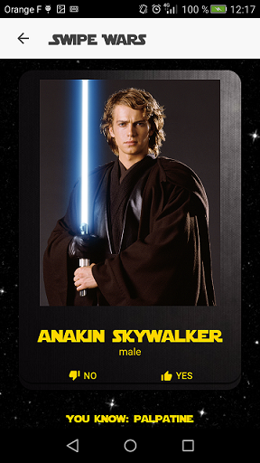
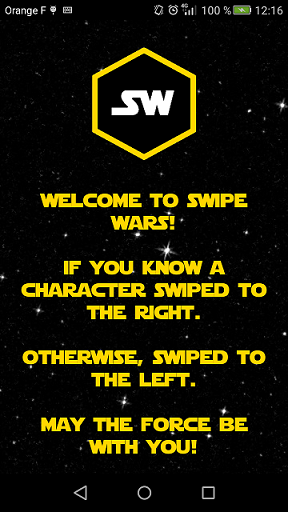
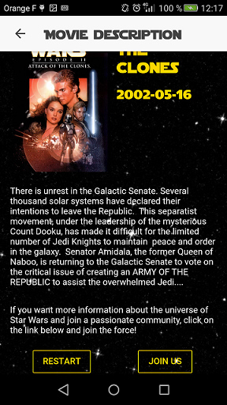

<h1 align="center">
  <br>
  </a>
  <br>
  SwipeWars
  <br>
</h1>

<h4 align="center">A easy-to-use application for Star Wars newbie built with <a href="https://nodejs.org/" target="_blank">Node</a> and <a href="https://ionicframework.com/" target="_blank">Ionic</a>.</h4>

<p align="center">
  <a href="https://www.npmjs.com/package/node">
    
  </a>
  <a href="https://www.npmjs.com/package/express">
    
    </a>
    <a href="https://www.npmjs.com/package/node-rest-client">
    
    </a>
    <a href="https://www.npmjs.com/package/body-parser">
    
    </a>
</p>

<p align="center">
  <a href="#Presentation">Presentation</a> •
  <a href="#key-features">Key Features</a> •
  <a href="#how-to-use">How To Use</a> •
  <a href="#download">Download</a> •
  <a href="#credits">Credits</a> •
</p>






## Presentation
Cette application est découper en 3 parties:
- Le front contient le code de l'application mobile.

- Le Back contient l'API REST, cette API permet de récuperer les données pour le bon fonctionnement de l'application. Dans cette API les données sont chargées en "local" afin d'améliorer le temps de réponse de l'application, cela permet aussi en cas de panne des api extérieurs (google api et swapi) un bon fonctionnement.

- Le Back_auto est un service permettant d'appeller l'API REST 'back' afin de générer les données automatiquement 1 fois par jours.


## Key Features

* Swipe Caracters -
  - If you know a caracter, then swipe to the right.
  - And if you didn't know him, then swipe to the left.
* After some swiping, you will be offered two films, which correspond to your answers  

## How To Use

To clone and run this application, you'll need [Git](https://git-scm.com) and [Node.js](https://nodejs.org/en/download/) (which comes with [npm](http://npmjs.com)) installed on your computer. From your command line:


```bash
# Clone this repository
$ git clone https://github.com/bloodess/ProjetAlvinM2


Client :
# Go into the repository
$ cd ProjetAlvinM2/front/swipewars

# Install dependencies
$ npm install

# Run the app
$ ionic serve

back :
# Go into the repository
cd ProjetAlvinM2/back

# Install dependencies
$ npm install

#Run serveur
npm start

back_auto :
# Go into the repository
cd ProjetAlvinM2/back_auto

# Install dependencies
$ npm install

#Run serveur
npm start

```


Note: If you're using Linux Bash for Windows, [see this guide](https://www.howtogeek.com/261575/how-to-run-graphical-linux-desktop-applications-from-windows-10s-bash-shell/) or use `node` from the command prompt.

## Credits

This software uses code from several open source packages.

- [Node.js](https://nodejs.org/)
- [Ionic](https://ionicframework.com/)
- [Angular2-Swing](https://github.com/ksachdeva/angular2-swing)
- [Heroku](https://www.heroku.com/)
- Images are taken from [Google](https://images.google.fr/)

---

> GitHub [@bloodess](https://github.com/bloodess) &nbsp;&middot;&nbsp;


